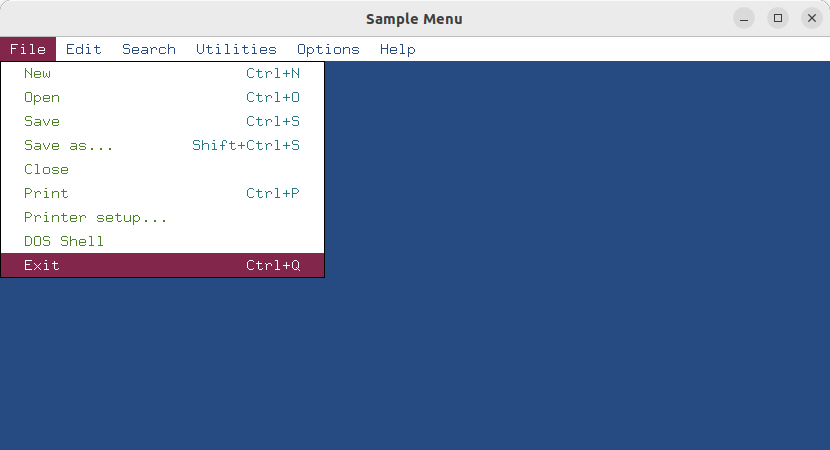

# Text environment based on GLFW

`gtglfw` is a GT driver that utilizes [GLFW](https://www.glfw.org/) for handling input and output in a
text environment. The aim of this project is to create an interface that uses GLFW to emulate a traditional text environment, while employing fixed-width fonts.

The project is currently under development.

The purpose of `gtglfw` is to create a GT driver that merges traditional text environments with modern graphic technologies. This project aims to facilitate the
creation of more dynamic and interactive text-based applications while maintaining familiar mechanisms and interfaces.

### Getting Started

For more info see [getting started](docs/README.md).

### Example

Sample Menu [menu.c](tests/menu.c)

File manager [hc.c](utils/hc/hc.c)

aaaa
bbbb
cccc
