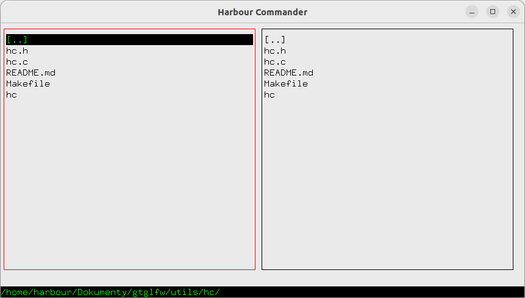

# Harbour Commander

Harbour Commander is a lightweight, cross-platform file manager featuring a dual-pane interface. It is designed for speed and ease of use.

### Example

File manager [hc.c](hc.c)



### To build and run hc:

- First, build a library [gtglfw](../../docs/README.md)

- MSYS2
   ```
   cd utils/hc/
   make
   ```
   or:
   ```
   gcc hc.c -o hc -I ../../include -L ../../lib -lgtglfw -lopengl32 -lglfw3
   ```
- Linux
   ```
   cd utils/hc/
   make
   ```
   or:
   ```
   gcc hc.c -o hc -I ../../include -L ../../lib -lgtglfw -lGL -lglfw
   ```
---
